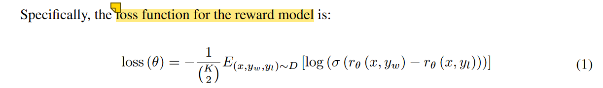

# InstructGPT-reproduce
reproduce the InstructGPT from the paper 《Training language models to follow instructions with human feedback》


## 1. InstructGPT概述
- InstructGPT是OpenAI在2022年提出的一个重要模型1，它的主要目标是让语言模型更好地遵循人类指令。这个模型是在GPT-3的基础上，通过人类反馈强化学习（RLHF）进行优化的。

## 2. 技术原理

### 2.1 监督微调（Supervised Fine-Tuning, SFT）
- 收集人类编写的示范数据（prompt-completion pairs）
- 使用这些数据对预训练模型进行微调
- 得到一个初步的指令跟随模型

### 2.2 奖励模型训练（Reward Model Training）
- 收集人类对模型回答的偏好数据
- 训练一个奖励模型来预测人类偏好
- 奖励模型的输入是(prompt, completion)对
- 输出是一个标量分数，表示回答的质量

### 2.3 强化学习优化（PPO Training）
-使用PPO（Proximal Policy Optimization）算法
- 用奖励模型的输出作为强化学习的奖励信号
- 优化策略（policy）以最大化预期奖励
- 同时使用KL惩罚项来防止模型与原始行为过度偏离


## 关键实现细节说明
### 1. 模型架构
基础模型使用GPT-2作为示例
添加了价值头（value head）用于奖励预测
使用Transformer架构进行序列生成

### 2. 训练过程
#### SFT阶段：
使用人类编写的示范数据
标准的监督学习方法
使用交叉熵损失

- **奖励模型训练**：
  - 收集人类偏好数据
  - 使用paired comparison训练
  - 输出标量奖励分数



#### PPO训练：
实现了PPO的关键组件
包含重要的截断比率（clip ratio）
KL散度约束确保稳定性


## Original Project
- This project combined the content of this repo: [RLHF_instructGPT](https://github.com/LanXiu0523/RLHF_instructGPT.git)


## Run
- 单机单卡


- 单机多卡

- 多机多卡


## Running Snapshot


## Results


## References
```bibtex
@misc{ouyang2022traininglanguagemodelsfollow,
      title={Training language models to follow instructions with human feedback}, 
      author={Long Ouyang and Jeff Wu and Xu Jiang and Diogo Almeida and Carroll L. Wainwright and Pamela Mishkin and Chong Zhang and Sandhini Agarwal and Katarina Slama and Alex Ray and John Schulman and Jacob Hilton and Fraser Kelton and Luke Miller and Maddie Simens and Amanda Askell and Peter Welinder and Paul Christiano and Jan Leike and Ryan Lowe},
      year={2022},
      eprint={2203.02155},
      archivePrefix={arXiv},
      primaryClass={cs.CL},
      url={https://arxiv.org/abs/2203.02155}, 
}

```


```bibtex
@misc{lan2023rlhf,  
    author = {Lan Xiu},  
    title = {RLHF\_instructGPT: Reproduce instructGPT},  
    year = {2023},  
    publisher = {GitHub},  
    journal = {GitHub repository},  
    howpublished = {\url{https://github.com/LanXiu0523/RLHF_instructGPT}},  
    commit = {0e4705660bc5e7fe60a4aacacc687ed928476b1b} 
}

```


